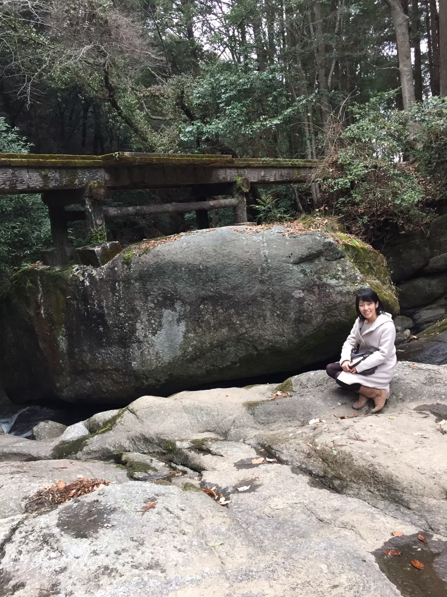

- __Name:__ Asako Toyama
- __Ocupation:__ Researcher at Nagoya University
- __Research Interest:__ Decision making, Reinforcement learning, Memory, Habit
- __Email:__ toyama.asako[at]b.mbox.nagoya-u.ac.jp
- __Favorite Things:__ I love hot yoga, coffee, tomato, and nature!

    
I did a PhD of psychology at Nagoya University with [Hideki Ohira](https://scholar.google.com/citations?user=E7yKMWUAAAAJ&hl=ja) and [Kentaro Katahira](https://sites.google.com/site/nagoyacbslab/). 
My PhD work was about _"Reinforcement Learning in Humans: Rethinking Psychologically Plausible Model-Free and Model-Based Algorithms."_ I'm interested in understanding human decision-making process using behavioral tasks and computational approach.

__I am looking for a job now!__

